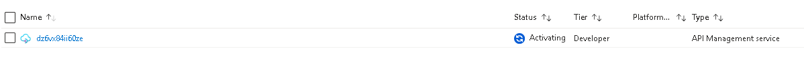
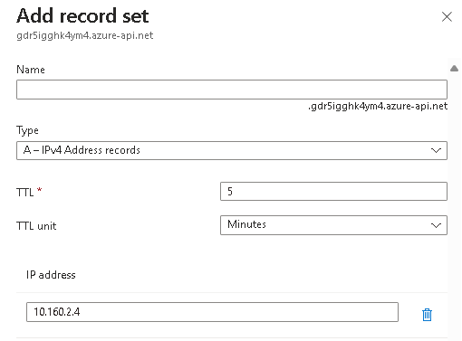
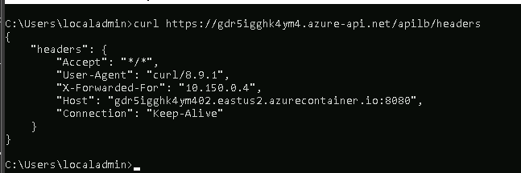
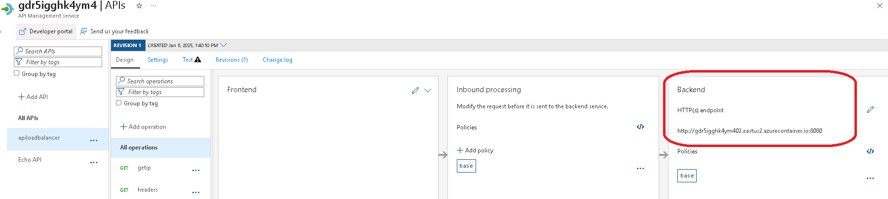
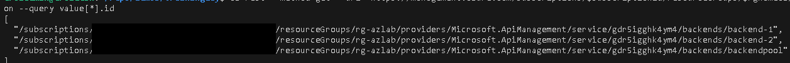
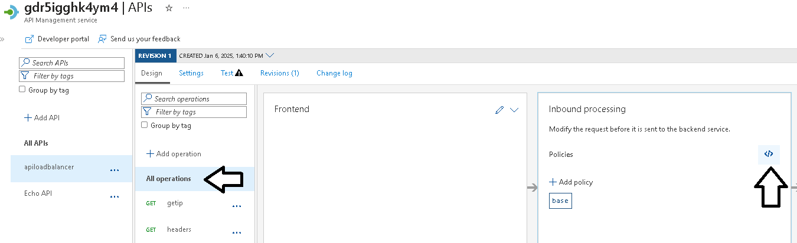
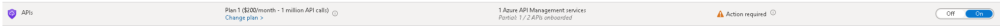
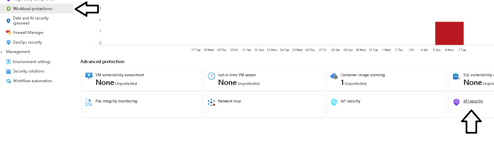

# Laboratorio Azure Day - Azure APIM

Para os testes com o APIM, vamos utilizar o servidor Windows como ponte, pois temos uma implementação privada e precisamos estar na mesma rede que o VIP para realizar os testes.

## Criar instancia do API Backend

1. Criar segunda instancia da aplicacao no container instance para balanceamento no Azure APIM.

    ```
    export instancename="app02"

    az container create --resource-group $rgnameaz --name $instancename --location $location \
    --image $acrimageurn \
    --dns-name-label "${resourcename}02" --ports 8080 --os-type Linux \
    --memory 1 --cpu 1 \
    --assign-identity \
    --registry-username $ACR_TOKEN_USERNAME \
    --registry-password $ACR_TOKEN_PASSWORD1
    ```

2. Validar a URL e porta do Container Instance

    ```
    az container show --resource-group $rgnameaz --name $instancename -o table --query "{URL:ipAddress.fqdn, Porta:ipAddress.ports[0].port}"
    ```

## Azure APIM

1. Configurar a NSG para a virtual network.

    ```
    az network nsg create --resource-group $rgnameaz --name APIM-nsg --location $location

    az network nsg rule create --resource-group $rgnameaz --nsg-name APIM-nsg --name TCP-80-443 --protocol tcp --direction inbound  --source-address-prefix '*' --source-port-range '*' --destination-address-prefix 'VirtualNetwork' --destination-port-range [80,443] --access allow --priority 200

    az network nsg rule create --resource-group $rgnameaz --nsg-name APIM-nsg --name TCP-3443 --protocol tcp --direction inbound  --source-address-prefix 'ApiManagement' --source-port-range '*' --destination-address-prefix 'VirtualNetwork' --destination-port-range 3443 --access allow --priority 201

    az network nsg rule create --resource-group $rgnameaz --nsg-name APIM-nsg --name TCP-6390 --protocol tcp --direction inbound  --source-address-prefix 'AzureLoadBalancer' --source-port-range '*' --destination-address-prefix 'VirtualNetwork' --destination-port-range 6390 --access allow --priority 202

    az network nsg rule create --resource-group $rgnameaz --nsg-name APIM-nsg --name StorageAccount --protocol tcp --direction outbound  --source-address-prefix 'VirtualNetwork' --source-port-range '*' --destination-address-prefix 'Storage' --destination-port-range 443 --access allow --priority 203

    az network nsg rule create --resource-group $rgnameaz --nsg-name APIM-nsg --name SqlServer --protocol tcp --direction outbound  --source-address-prefix 'VirtualNetwork' --source-port-range '*' --destination-address-prefix 'SQL' --destination-port-range 1433 --access allow --priority 204

    az network nsg rule create --resource-group $rgnameaz --nsg-name APIM-nsg --name KeyVault --protocol tcp --direction outbound  --source-address-prefix 'VirtualNetwork' --source-port-range '*' --destination-address-prefix 'AzureKeyVault' --destination-port-range 1433 --access allow --priority 205
    ```

2. Criar uma subnet para o APIM na VNET Azure.

    ```
    az network vnet subnet create --address-prefixes 10.160.2.0/24 --name APIM --resource-group $rgnameaz --vnet-name $az_vnetname --network-security-group APIM-nsg
    ```

3. Private DNS Zone

    ```
    az network private-dns zone create -g $rgnameaz -n $resourcename".azure-api.net"
    ```

4. Azure API Management
  + Informar os parametros de email e Publisher name com seu nome.
  + Bloco 1 cria o APIM (executa em aproximadamente 40min.)
  + Bloc 2 atualiza o APIM para modo interno na VNET. O prompt nao exibe status, mas no portal, você consegue observar que o status será "updating".
  + Se estiver executando via CloudShell, devido o longo tempo de provisionamento, pode desconectar do shell, por isto, acompanhe pelo portal o status e lembre de recriar as variaveis de ambiente.
    .

5. Criar o APIM
    ```
    az apim create --name $resourcename --publisher-email 'seuemail@dominio.com' --publisher-name 'seunome' --resource-group $rgnameaz --enable-managed-identity true --location $location --public-network-access true --sku-capacity 1 --sku-name Developer 
    ```

6. Atualizar o APIM para VNET Injected
    ```
    export apimResourceId=$(az apim show -n $resourcename -g $rgnameaz --query 'id' -o tsv)
    export subnetResourceId=$(az network vnet subnet show -g $rgnameaz -n apim --vnet-name $az_vnetname --query 'id' -o tsv)
    az resource update --ids $apimResourceId --set properties.virtualNetworkType="Internal" --set properties.virtualNetworkConfiguration.subnetResourceId=$subnetResourceId 
    ```

7. Publicar as APIs no APIM
    ```
    export httpbackenda=$(az container show --resource-group $rgnameaz --name $instancename -o tsv --query "ipAddress.fqdn")
    export httpporta=$(az container show --resource-group $rgnameaz --name $instancename -o tsv --query "ipAddress.ports[0].port")
    export backendAurl=$httpbackenda":"$httpporta

    az apim api create --api-id apilb --display-name apiloadbalancer --path apilb --service-name $resourcename --resource-group $rgnameaz --service-url http://$backendAurl
    az apim api operation create --api-id apilb --display-name getip --method get --service-name $resourcename --resource-group $rgnameaz --url-template /getip
    az apim api operation create --api-id apilb --display-name headers --method get --service-name $resourcename --resource-group $rgnameaz --url-template /headers
    ```

## Habilitar logs de Monitoração

1. Habilitar os logs de diagnostico do APIM.

    ```
    export apimid=$(az apim show --name $resourcename --resource-group $rgnameaz --query id -o tsv)

    export lawid=$(az monitor log-analytics workspace show --resource-group $rgnameaz --name $resourcename -o tsv --query id)

    az monitor diagnostic-settings create --name apimdiag --resource $apimid --export-to-resource-specific true --workspace $lawid --logs "[{categoryGroup:audit,enabled:true}]"
    ```

## Validar a instalação do Azure API Management

1. Validar no portal do Azure que o status do APIM é **"ONLINE"**.

2. Abrir o servidor Windows via Bastion e testar a URL de Gateway do APIM. A resoluçao de nome vai falhar, o que precisamos fazer para resolver?

    + Link a private zone **nomedorecurso**.azure-api.net na VNET Azure.
    + Criar um RecordSet na private zone vazio apontando para o IP privado da instancia (olhar no portal do Azure > APIM > Virtual IP (VIP) addresses)

        

    + Criar um Forward no serviço DNS Windows da VM para a zona **nomedorecurso**.azure-api.net para o IP de Inbound do Private Resolver.

3. Testar se as APIs previamente cadastradas estão responsivas (é possivel testar a partir da VM linux também.)
 
    ```
    # Obter a URL do Gateway (ou consultar no portal)
    az apim show -n $resourcename -g $rgnameaz -o tsv --query gatewayUrl
    ```

    ```
    #Linux VM - Bash 
    curl gatewayUrl/apilb/headers

    # Windows VM - Powershell 
    (curl gatewayUrl/apilb/headers).Content
    ```

    

## PlayGround

Agora que temos nosso API Managament devidamente configurado é hora de realizarmos alguns setups e explorar funcionalidades para o uso na construção de um barramento de APIs.

1. Nosso primeiro cenário é explorar as capacidades de Load Balancer do APIM para dois endpoints diferentes. Examine a atual configuração da API  **"apiloadbalancer"**, ela possui um backend estático apontando para nossa container APP01.

    

2. Vamos adicionar alguns objetos no Azure APIM chamados de Backends, uma para cada APP que temos e depois criar um Pool (tipo não disponivel na interface gráfica) apontando para estes dois backends.

    ```
    ## Criar variaveis para o Endpoint do APP 01
    export subscriptionid=$(az account show -o tsv --query id)
    export backendAid="backend-1"
    export httpbackenda=$(az container show --resource-group $rgnameaz --name app01 -o tsv --query "ipAddress.fqdn")
    export httpporta=$(az container show --resource-group $rgnameaz --name app01 -o tsv --query "ipAddress.ports[0].port")
    export backendAurl=$httpbackenda":"$httpporta

    ## Criar o backend APP01
    az rest --method put \
        --url https://management.azure.com/subscriptions/$subscriptionid/resourceGroups/$rgnameaz/providers/Microsoft.ApiManagement/service/$resourcename/backends/$backendAid?api-version=2024-06-01-preview \
        --body "{\"name\": \"$backendAid\",\"properties\": {\"credentials\": {\"header\": {},\"query\": {}},\"description\": \"$backendAid\",\"protocol\": \"http\",\"title\": null,\"tls\": {\"validateCertificateChain\": true,\"validateCertificateName\": true},\"url\": \"http://$backendAurl\"}}"

    ## Criar variaveis para o Endpoint do APP 02
    export backendBid="backend-2"
    export httpbackendb=$(az container show --resource-group $rgnameaz --name app02 -o tsv --query "ipAddress.fqdn")
    export httpportb=$(az container show --resource-group $rgnameaz --name app02 -o tsv --query "ipAddress.ports[0].port")
    export backendBurl=$httpbackendb":"$httpportb

    ## Criar o backend APP02
    az rest --method put \
        --url https://management.azure.com/subscriptions/$subscriptionid/resourceGroups/$rgnameaz/providers/Microsoft.ApiManagement/service/$resourcename/backends/$backendBid?api-version=2024-06-01-preview \
        --body "{\"name\": \"$backendBid\",\"properties\": {\"credentials\": {\"header\": {},\"query\": {}},\"description\": \"$backendBid\",\"protocol\": \"http\",\"title\": null,\"tls\": {\"validateCertificateChain\": true,\"validateCertificateName\": true},\"url\": \"http://$backendBurl\"}}"

    ## Criar o backend do tipo POOL com os dois backends anteriores.
    az rest --method put \
        --url https://management.azure.com/subscriptions/$subscriptionid/resourceGroups/$rgnameaz/providers/Microsoft.ApiManagement/service/$resourcename/backends/backendpool?api-version=2024-06-01-preview \
        --body '{"properties": {"title": null,"description": "backend pool teste","type": "Pool","url": null,"protocol": null,"pool": {"services": [{"id": "/subscriptions/$subscriptionid/resourceGroups/$rgnameaz/providers/Microsoft.ApiManagement/service/$resourcename/backends/backend-1","weight": 3,"priority": 1},{"id": "/subscriptions/$subscriptionid/resourceGroups/$rgnameaz/providers/Microsoft.ApiManagement/service/$resourcename/backends/backend-2","weight": 1,"priority": 1 }]}}}'

    ```
3. Podemos consultar os objetos criados através desta chamada REST. Deve retornar 3 IDs.

    ```
    az rest --method get --url "https://management.azure.com/subscriptions/$subscriptionid/resourceGroups/$rgnameaz/providers/Microsoft.ApiManagement/service/$resourcename/backends?api-version=2024-06-01-preview" -o json --query value[*].id

    ```
    

Para que nossa API faça uso destes objetos, precisamos ajustar a politica dentro da API, podemos fazer em diferentes escopos (Geral, API, Metodo). No nosso exemplo, vamos fazer a configuração do Backend para a API.

4. No portal do Azure > APIM > APIs > APIM > **"apiloadbalancer"** > na TAB design > All operations. No quadro de **"inbound processing"** clicar no "policy code editor".

    

5. No editor, localizar no XML a seção inbound e depois da linha \<base /> adicionar a linha ```<set-backend-service backend-id="backendpool" /> ``` e clicar em salvar.

> Nota: Ignorar o erro "Could not load policies. Please try again later.".

6. Realizar novos testes na API com o endpoint /getip. Observar o valor da resposta JSON "hostname" que vai alternar com o hostname da instancia das APP01 e APP02.

    ```
    curl -X GET https://$resourcename.azure-api.net/apilb/getip
    ```

Vamos adicionar a nossa politica o contexto de autenticação outbound, ou seja, o nosso backend requer uma autenticação e vamos utilizar o contexto do Azure APIM, a system management identity, para gerar um Bear Token que será enviado ao backend para autenticação.

7. Avaliar o output da chamada headers ```curl -X GET https://$resourcename.azure-api.net/apilb/headers```

8. Vamos abrir a "policy code editor" da operação Headers e adicionar depois do \<base />

    ```
    <authentication-managed-identity resource="https://management.azure.com" output-token-variable-name="managed-id-access-token" ignore-error="false" />
    <set-header name="Authorization" exists-action="override">
        <value>@("Bearer " + (string)context.Variables["managed-id-access-token"])</value>
    </set-header>
    ```
9. Executar novamente a chamada ao endpoint do /headers, observe que agora o header Authorization foi adicionado a chamada ao backend.

Vamos adicionar agora uma camada de validação de token JWT para controlar quem pode chamar a nossa API. Aqui estamos invertendo, exigindo que quem chamar nossa API no barramento, apresente um token de authenticação (por exemplo, de uma App registrada no Entra ID).

10. Vamos abrir a "policy code editor" da operação Headers e adicionar antes do \<base />

    ```
    <validate-jwt header-name="Authorization" failed-validation-httpcode="401" failed-validation-error-message="Unauthorized. Access token is missing or invalid.!" require-scheme="Bearer">
        <openid-config url="https://login.microsoftonline.com/ab3bf950-3a2a-4efc-a1ef-aa4cb708d66c/.well-known/openid-configuration" />
        <audiences>
            <audience>api://4da6dbe2-2b02-4c41-83c5-9ac5fc78693c</audience>
        </audiences>
        <required-claims>
            <claim name="roles" match="any" separator=",">
                <value>get-status</value>
            </claim>
        </required-claims>
    </validate-jwt>
    ```
## API Security - Microsoft Defender for API

1. Habilitar as funcionalidades do Defender for Storage na subscription

  + No portal do Azure > Microsoft Defender for Cloud  > No menu seção **"management"** > clicar em **"Environment settings"**
  + Na parte inferior, expandir Azure > Management Group > Subscription > clicar no nome da subscription.
  + No menu **"Defender plans"** ligar a funcionalidade **"API"**. Na coluna pricing, clicar em **"Change plan"** e observars os diferentes planos de monitoração.

    


2. As APIs integradas ao plano do do Defender aparecem no painel de segurança de API na Proteção de carga de trabalho e no Inventário do Microsoft Defender. 

    Navegue até a seção **Workload protection** em **Advanced Protection** e selecione **API Security** em Proteções avançadas de carga de trabalho.

    

## Referencias do módulo

1. [Azure APIM instance to a virtual network - internal mode](https://learn.microsoft.com/en-us/azure/api-management/api-management-using-with-internal-vnet?tabs=stv2)
2. [Backends in API Management](https://learn.microsoft.com/en-us/azure/api-management/backends?tabs=bicep)
3. [API Management policy expressions](https://learn.microsoft.com/en-us/azure/api-management/api-management-policy-expressions)
4. [Protect your APIs with Defender for APIs](https://learn.microsoft.com/en-us/azure/defender-for-cloud/defender-for-apis-deploy)
5. [Enable API security posture with Defender CSPM](https://learn.microsoft.com/en-us/azure/defender-for-cloud/enable-api-security-posture)
6. [Architecture: Protect APIs with Application Gateway and API Management](https://learn.microsoft.com/en-us/azure/architecture/web-apps/api-management/architectures/protect-apis)
7. [Techcommunity: Introducing GenAI Gateway Capabilities in Azure API Management](https://techcommunity.microsoft.com/blog/integrationsonazureblog/introducing-genai-gateway-capabilities-in-azure-api-management/4146525)
8. [Techcommunity: Integrating API Management with App Gateway V2](https://techcommunity.microsoft.com/blog/azurepaasblog/integrating-api-management-with-app-gateway-v2/1241650 )
9. [Apim LandingZoneAccelerator](https://github.com/Azure/apim-landing-zone-accelerator/tree/main)
10. [AI Gateway](https://github.com/Azure-Samples/AI-Gateway/tree/main)
