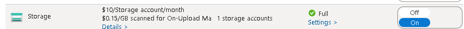
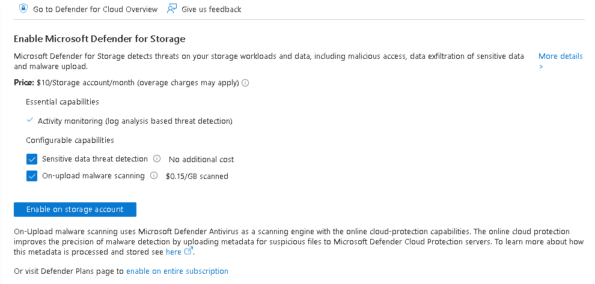
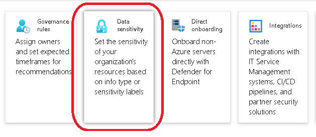
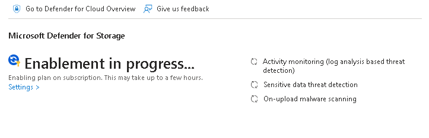
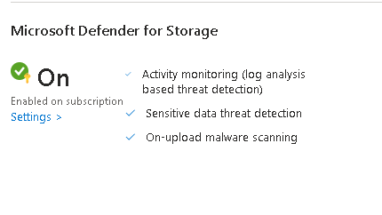
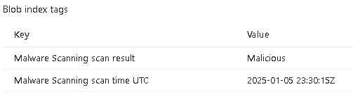
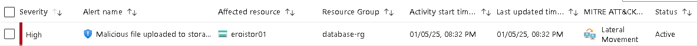
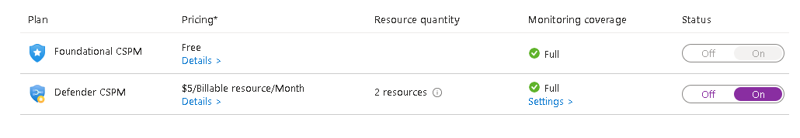
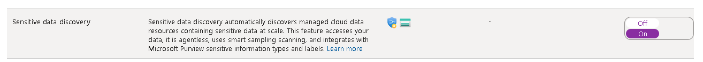
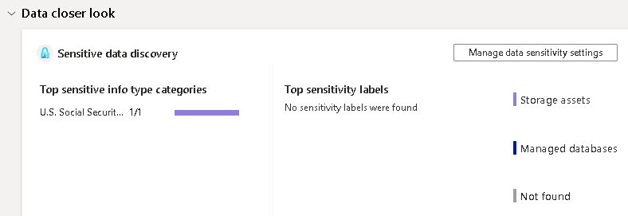

# Laboratorio Azure Day - Defender for Cloud

## Papel do CNAPP / CSPM

Uma **CNAPP (Cloud-Native Application Protection Platform)** é uma plataforma unificada que simplifica a proteção de aplicativos nativos da nuvem durante todo o ciclo de vida. Ela integra várias soluções de segurança da nuvem, como CSPM (Cloud Security Posture Management), CIEM (Cloud Infrastructure Entitlement Management), IAM (Identity and Access Management), CWPP (Cloud Workload Protection Platform) e proteção de dados, em uma única interface.

### Benefícios de uma CNAPP

1. **Suporte a várias nuvens:** Unifica a segurança e a conformidade em ambientes de nuvem pública e privada.
2. **Inteligência contra ameaças:** Prioriza vulnerabilidades críticas e automatiza recomendações e correções.
3. **Gerenciamento centralizado:** Monitora governança e conformidade de dados, impondo o princípio de acesso menos privilegiado.
4. **Colaboração DevOps:** Permite que equipes de segurança e desenvolvedores trabalhem juntos para inserir segurança no código desde o início.
5. **Proteção abrangente:** Melhora a visibilidade de cargas de trabalho para detectar vulnerabilidades e configurações incorretas.

### Como Adotar uma Solução de CNAPP

1. **Avalie suas necessidades:** Identifique os requisitos de segurança e conformidade da sua organização.
2. **Escolha a solução certa:** Pesquise e selecione uma CNAPP que atenda às suas necessidades específicas. Considere fatores como suporte a múltiplas nuvens, integração com ferramentas existentes e facilidade de uso.
3. **Planeje a implementação:** Desenvolva um plano detalhado que inclua etapas de integração, treinamento da equipe e migração de dados.
4. **Integre com DevOps:** Garanta que a solução CNAPP seja integrada aos processos de desenvolvimento e operações para facilitar a colaboração e a segurança contínua.
5. **Monitore e ajuste:** Após a implementação, monitore continuamente a eficácia da solução e faça ajustes conforme necessário para manter a segurança e a conformidade.

Adotar uma CNAPP pode parecer desafiador, mas com um planejamento adequado e a escolha da solução certa, você pode proteger eficazmente seus aplicativos nativos da nuvem. 


## Defender for Storage Account

1. Habilitar as funcionalidades do Defender for Storage na subscription

  + No portal do Azure > Microsoft Defender for Cloud  > No menu seção **"management"** > clicar em **"Environment settings"**
  + Na parte inferior, expandir Azure > Management Group > Subscription > clicar no nome da subscription.
  + No menu **"Defender plans"** ligar a funcionalidade **"Storage"**
  

2. Se desejado, é possivel habilitar apenas para um storage account especifico, ao inves de seguir o passo 1, habilitar diretamente no Storage Account.

  + No portal do Azure > Storage Account > Clicar no nome do Storage Account > No menu **"Security + Networking"** selecionar **"Microsoft Defender for Cloud"**
  

3. Data sensitivity

  + Para controlar as configuracoes de sensibilidade de dados, no portal do Azure > Microsoft Defender for Cloud  > No menu seção **"management"** > clicar em **"Environment settings"**.
  + Na parte superior clicar em **"Data Sensitivity"**

    
  
  + no item **"Set resource sensitivity based on info types"** clicar em **"Other"** e na lista marcar os itens Brazil (CPF, CNPJ, RG). Aplicar e na tela anterior clicar em **"Save"**

  + Na seção **"Set sensitivity label threshold"** clicar em change e marcar o CPF. Aplicar a configuraçao e salvar.

Importante, o laborario de teste somente vai funcionar depois de ativado a proteçao no Storage Account, que pode ser observado dentro do contexto de **"Microsoft Defender for Cloud"** do Storage Account.

#### Ativação em andamento:



#### Ativação Concluida:




#### Testar Scan Malware

Para o teste de Malware scan, vamos utilizar os arquivos de exemplo da [Eicar](https://www.eicar.org/download-anti-malware-testfile/) e para evitar trigar endpoint de segurança, **ESTE EXERCICIO** deve ser executado via Azure Cloud Shell. 

0. Nao esquecer de executar algumas variaveis de ambiente ;)

    ```
    export resourcename="" #informar entre "" o mesmo valor da variavel
    ```
1. Criar um container chamado security

    ```
    az storage container create --name security --account-name $resourcename
    ```
2. Baixar os arquivos de exemplo da Eicar utilizando o curl.

    ```
    curl 'https://secure.eicar.org/eicar.com.txt' -o eicar.com.txt

    curl -v -L 'https://secure.eicar.org/eicar_com.zip' -o eicar_com.zip
    ```

3. Fazer o upload dos arquivos para o container security

    ```
    az storage blob upload -f ./eicar.com.txt -c security -n eicar.com.txt --account-name $resourcename --auth-mode login

    az storage blob upload -f ./eicar_com.zip -c security -n eicar_com.zip --account-name $resourcename --auth-mode login
    ```

4. Os alertas vao aparecer em 2 lugares. 
    + Na **"Blob index tags"** do blob

      

    + No **"Microsoft Defender for Cloud"** em **Security Alerts**

      


#### Data sensitivity

O Data sentitivity depende do Defender for Cloud CSPM habilitado para fazer o SCAN, por isto, nas configurações do Defender for cloud da subscription (Defender for cloud > Enviroment settings > Subscription > Defender Plan) ligar o modo do CSPM.



e ao clicar em settings na columa **Monitoring Coverage** garantir que a opção **"Sensitive data discovery"** esta como **"ON"**. Salve/Confirme em todas as telas.




1. Gerar um arquivo com dados sensiveis. 

    Se você não habilitou o label de dados Brasil, pode fazer o teste usando o exemplo do SSN Americano, no console do cloud shell com o comando vi criar um arquivo com o conteudo **ASD 100-22-3333 SSN Text** e fazer o upload.

    Se quiser realizar o teste com dados mocados no formato CPF, o seguinte CSV pode ser utilizado.

      ```
      CPF,Full Name,Professional
      805.134.124-41,Zeus,Engineer
      876.530.714-30,Hera,Nurse
      143.529.793-84,Poseidon,Musician
      780.765.414-76,Demeter,Nurse
      429.643.176-58,Athena,Architect
      499.242.921-11,Apollo,Teacher
      069.648.352-10,Artemis,Nurse
      645.473.049-20,Ares,Nurse
      910.769.905-09,Aphrodite,Chef
      780.538.249-27,Hephaestus,Engineer
    ```

2. O processo de scan pode levar algumas horas para iniciar e alertas. Os alertas ficam no  **Defender for Cloud**  > Cloud Security **"Data and AI security (preview)"** ou **"Data security"**

    


## Referencias do módulo

1. [Sensitive data threat detection](https://learn.microsoft.com/en-us/azure/defender-for-cloud/defender-for-storage-data-sensitivity)

2. [Introduction to malware scanning](https://learn.microsoft.com/en-us/azure/defender-for-cloud/introduction-malware-scanning)

3. [Test the Defender for Storage data security features](https://learn.microsoft.com/en-us/azure/defender-for-cloud/defender-for-storage-test)