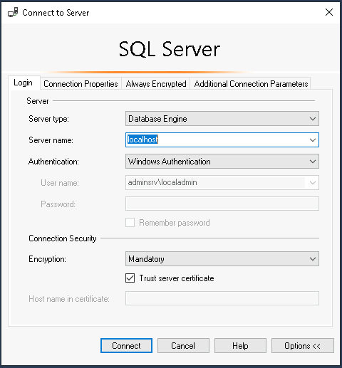

# Laboratorio Azure Day - Migração SQL para Azure SQL

Existem diferentes caminhos para realizar a migraçao de um banco de dados SQL onpremises para um database SQL como PaaS. Neste laboratorio vamos explorar alguns cenarios de revisão da compatibilidade do banco de dados com os diferentes modelos de banco como plataforma e alguns caminhos de migração.

## Data Migration Assistant

O DMA (Data Migration Assistant) permite que você atualize para uma plataforma de dados moderna detectando problemas de compatibilidade que podem afetar a funcionalidade do banco de dados em sua nova versão do SQL Server. Ele recomenda melhorias de desempenho e confiabilidade para seu ambiente de destino. Ele permite que você não apenas mova seu esquema e dados, mas também objetos não contidos do servidor de origem para o servidor de destino.

## Azure Data Studio

O Azure Data Studio é uma ferramenta para desenvolvedores leve e de gerenciamento de dados de plataforma cruzada, com conectividade com bancos de dados locais e na nuvem populares. O Azure Data Studio oferece suporte ao Windows, ao macOS e ao Linux, com capacidade imediata de conexão ao SQL do Azure e ao SQL Server. Navegue pela biblioteca de extensões para obter mais opções de suporte a bancos de dados, incluindo MySQL, PostgreSQL e Cosmos DB.

## Azure SQL migration extension

A extensão de migração do SQL do Azure para Azure Data Studio permite que você avalie, obtenha recomendações de tamanho adequado do Azure e migre seus bancos de dados do SQL Server para o Azure.

## [VM] Servidor SQL Onpremises e Admin  

1. TBD

## Azure SQL DB

1. Criar uma instancia Azure SQL DB

    ```

    az sql server create --name $resourcename --resource-group $rgnameaz --location $location \
    --admin-password $admpasswd --admin-user dbadmin --enable-public-network true --minimal-tls-version 1.2

    az sql db create --name proddb --resource-group $rgnameaz --server $resourcename \
    --compute-model Serverless -e GeneralPurpose -f Gen5 -c 1 \
    --backup-storage-redundancy Local --use-free-limit --free-limit-exhaustion-behavior AutoPause

    ```

2. Ajustar o Firewall do Azure SQL c/ Service Endpoint (Conecta com o Service endpoint da VNET)

    ```
    export subnetidop=$(az network vnet subnet list --resource-group $rgnameop --vnet-name $op_vnetname -o tsv --query "[?name=='ophosts'].id")

    az sql server vnet-rule create --name sql2azvnet --resource-group $rgnameaz --server $resourcename  --subnet $subnetidop
    ```

## Testar a conexao com os DBs

1. Testar a conexao com o servidor SQL local e com o Azure SQL. Identificar se o acesso é bem sucedido, se não, não realizar ajustes e apenas anotar o resultado.
  + Utilizar o SQL Manager Studio do servidor Windows.
  + Informa o nome do servidor, usuario e senha ou autenticaçõ integrada e manter a opção de "trust server certificate" sempre selecionada.

    


## Referencias do módulo

[Data Migration Assistant](https://learn.microsoft.com/en-us/sql/dma/dma-overview?view=sql-server-ver16)

[Azure Data Studio](https://learn.microsoft.com/en-us/azure-data-studio/)

[Azure SQL migration extension for Azure Data Studio](https://learn.microsoft.com/en-us/azure-data-studio/extensions/azure-sql-migration-extension?tabs=connected)