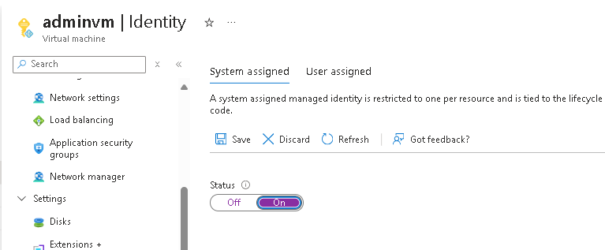

# Laboratorio Azure Day - Identity

## Habilitar Managed Identity na VM Windows

1. No portal do Azure > Virtual Machine > AdminVM > Security > Identity
2. Mudar o status do System Managed Identity para "on" e clicar em Salvar.
  

## Habilitar Entra ID Auth no Azure SQL

1. No portal do Azure buscar por "Azure SQL" e clicar no SQL server que hospeda o DB.
2. Entrar em menu > Setting > Microsoft Entra ID.
3. Clicar em +set Admin > e informar o seu usuario como administrador. Clicar em Save.

## Adicionar usuario do Entra ID no DB SQL.

1. No servidor Windows, utilizar o SQL Manager Studio para conectar no servidor Azure SQL.
2. Mudar a Autenticação para Entra ID e informar o seu usuario e senha no processo de login. Informar o DB Master.
3. Abrir o painel de nova query do SQL e executar:

    ```
    CREATE LOGIN adminvm FROM EXTERNAL PROVIDER
    GO
    ```

4. Criar uma nova conexão no SQL Manager Studio com os mesmos parametros, porem, mudar o database para proddb. 
5. Abrir o painel de nova query do SQL e executar:
    
    ```
    CREATE USER adminvm FOR LOGIN adminvm
    EXEC sp_addrolemember 'db_datareader', 'adminvm'
    ```

6. Criar uma tabela Exemplo.
    
    ```
    -- Create the table
    CREATE TABLE Professionals (
        name NVARCHAR(50),
        professional NVARCHAR(50)
    );
    GO
    -- Insert random data
    INSERT INTO Professionals (name, professional) VALUES
    ('John Doe', 'Engineer'),
    ('Jane Smith', 'Doctor'),
    ('Alice Johnson', 'Teacher'),
    ('Bob Brown', 'Artist'),
    ('Charlie Davis', 'Lawyer');
    GO
    ```

## Testar o acesso ao SQL utilizando a conta da VM.

1. Na VM Windows, abrir um command shell do powershell.
2. Executar o script abaixo que vai requisitar um token usando a conta da VM e abrir uma conexao com o SQL.
3. Trocar o nome do servidor SQL do exemplo (dz6vx84ii60ze) pelo nome do servidor SQL criado no seu ambiente.

    ```
    ## Gerar o token localmente e abrir a conexão.
    $response = Invoke-WebRequest -Uri "http://169.254.169.254/metadata/identity/oauth2/token?api-version=2018-02-01&resource=https%3A%2F%2Fdatabase.windows.net%2F" -Method GET -Headers @{Metadata="true"}	
    $content = $response.Content | ConvertFrom-Json
    $AccessToken = $content.access_token
    $SqlConnection = New-Object System.Data.SqlClient.SqlConnection
    $SqlConnection.ConnectionString = "Data Source=dz6vx84ii60ze.database.windows.net; Initial Catalog = proddb"
    $SqlConnection.AccessToken = $AccessToken
    $SqlConnection.Open()

    ## Abrir o Dataset e carregar o conteudo da tabela
    $SqlCmd = New-Object System.Data.SqlClient.SqlCommand
    $SqlCmd.CommandText = "SELECT * from professionals"
    $SqlCmd.Connection = $SqlConnection
    $SqlAdapter = New-Object System.Data.SqlClient.SqlDataAdapter
    $SqlAdapter.SelectCommand = $SqlCmd
    $DataSet = New-Object System.Data.DataSet
    $SqlAdapter.Fill($DataSet)

    ## Exibir o conteudo da tabela
    $DataSet.Tables[0] 

    ## Fechar a conexão.
    $SqlConnection.Close()

    ```

## Referencias do módulo

1. [What are managed identities for Azure resources?](https://learn.microsoft.com/en-us/entra/identity/managed-identities-azure-resources/overview)
2. [Connect to Azure SQL resource with Microsoft Entra authentication](https://learn.microsoft.com/en-us/azure/azure-sql/database/authentication-microsoft-entra-connect-to-azure-sql?view=azuresql)
3. [Create Microsoft Entra login](https://learn.microsoft.com/en-us/azure/azure-sql/database/authentication-azure-ad-logins-tutorial?view=azuresql)
4. [Get a token using HTTP](https://docs.azure.cn/en-us/entra/identity/managed-identities-azure-resources/how-to-use-vm-token)