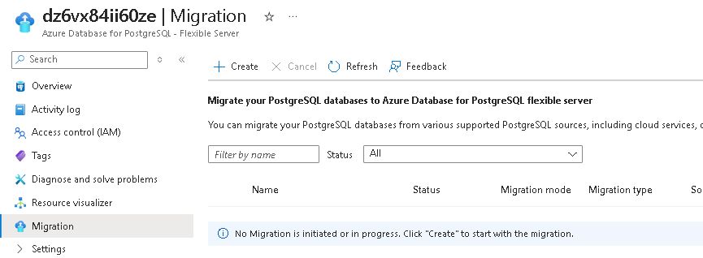
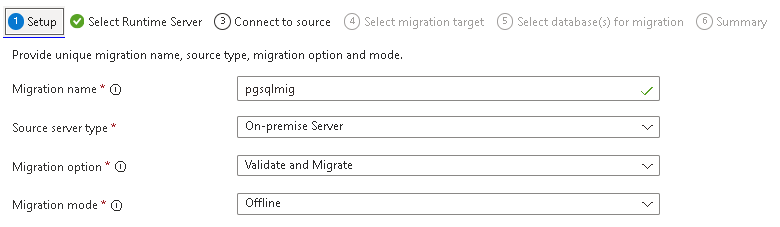
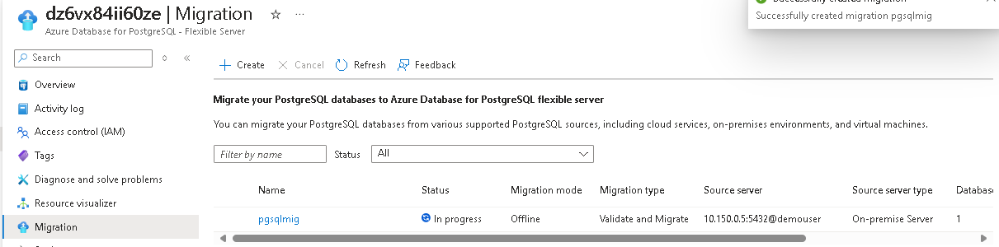

# Laboratorio Azure Day - Migração PostgreSQL para Azure PostgreSQL Flexible 

## [VM] Servidor PGSQL Onpremises

1. Criar um servidor linux com uma instancia postgresql local e criar um database.

    ```
    az vm create --resource-group $rgnameop --name vmpgsql \
    --image Oracle:Oracle-Linux:ol10-lvm-gen2:10.0.1 --size $vmsize --storage-sku StandardSSD_ZRS --vnet-name $op_vnetname --private-ip-address 10.150.0.5 \
    --subnet ophosts --nsg "" --nsg-rule None --public-ip-address "" --authentication-type password --admin-username pgadmin  --admin-password $admpasswd

    az vm extension set --name customScript --extension-instance-name pgsqlinstall --publisher Microsoft.Azure.Extensions --vm-name vmpgsql --resource-group $rgnameop --protected-settings '{"fileUris": ["https://raw.githubusercontent.com/eroiborges/Cloudlab/refs/heads/main/TrainingDay/files/PG-workload-install.sh"],"commandToExecute": "sh ./PG-workload-install.sh"}'

    ```

## Azure PGSQL DB

1. Criar uma PrivateDNS Zone

    ```
    az network private-dns zone create -g $rgnameaz -n ${resourcename}-dns.private.postgres.database.azure.com

    export pgsqldnsid=$(az network private-dns zone show -g $rgnameaz -n ${resourcename}-dns.private.postgres.database.azure.com --query id -o tsv)
    ```
2. Criar uma instancia PostgreSQL FlexibleServer

    ```
    az postgres flexible-server create --name $resourcename --resource-group $rgnameaz --location $location \
    --version 16 --create-default-database Enabled --storage-size 32 --password-auth Enabled \
    --admin-user dbadmin --admin-password $admpasswd \
    --tier Burstable --storage-type Premium_LRS \
    --private-dns-zone $pgsqldnsid \
    --vnet $az_vnetname --subnet pgsqlnet --yes -o json
    ```

## Testar a conexao com os DBs

1. Testar a conexao com o servidor PGSQL local e com o Azure PGSQL. Identificar se o acesso é bem sucedido, se não, não realizar ajustes e apenas anotar o resultado.
  
  + Utilizar o psql no servidor Linux. instrucoes abaixo.

    ``` 
    #PGSQL local
    psql -h 10.150.0.5 -p 5432 -U demouser -d northwind -W

    #Azure PGSQL - Verificar se o IP esta correto com o deployment 
    psql -h 10.160.0.68 -p 5432 -U dbadmin -d postgres -W
    ```

  + Comandos para PGSQL

    | Commando | Objetivo |
    | -------- | -------- |
    | \l |Lista todos os DBs|
    | \c database |Troca de database|
    | \dt| lista as tabelas do DB connectado|
    | \d tabela | Informações sobre a tabela |
    | \du | Lista os usuarios |
    |\q  | sai da instancia|
    | | |

## Connection String com PGSQL local e Azure.

+ PGSQL Local: psql -h 10.150.0.5 -p 5432 -U demouser -d northwind -W

+ PGSQL Azure: psql -h \<nomedainstancia\>.postgres.database.azure.com -p 5432 -U dbadmin -d postgres -W

  > Nota: Se a resolução de nomes falhar, verifique a estrutura de DNS (Server, Private Resolver, Private Zone)

## Criar Database Migration Project no Azure PGSQL.

1. Abrir o portal do Azure e selecionar o DB PGSQL.
2. No Menu selecionar a opçao "Migration".
  
3. Clicar em **\+Create** e informar os dados de origem e destino dos servidores postgreSQL.

    + SETUP

      

    + Runtime: Informar "no"
    + Connect to Source: Informar os dados do PGSQL origem
    + Select Migration Target: Informar os dados do PGSQL destino
    + Select Database for Migration: Selecionar apenas o DB NorthWind
    + Inicar a validação e migração.
  
  Aguardar a migraçao concluir 

  

4. Validar os dados do database Nortwind.

+ Conectar: psql -h \<nomedainstancia\>.postgres.database.azure.com -p 5432 -U dbadmin -d northwind -W
+ Executar um Select como ``` select * from categories; ```

5. Recriar o login de usuario da aplicação.

    Executar:

    ```
    CREATE USER demouser WITH PASSWORD 'demopass123';
    GRANT SELECT ON ALL TABLES IN SCHEMA public TO demouser;
    GRANT EXECUTE ON ALL FUNCTIONS IN SCHEMA public TO demouser;
    ``` 

## Referencias do módulo

1. [What is the migration service in Azure Database for PostgreSQL?](https://learn.microsoft.com/en-us/azure/postgresql/migrate/migration-service/overview-migration-service-postgresql)