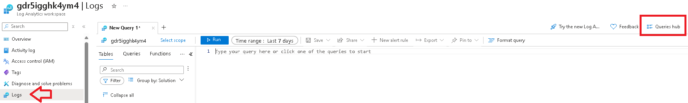
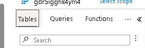
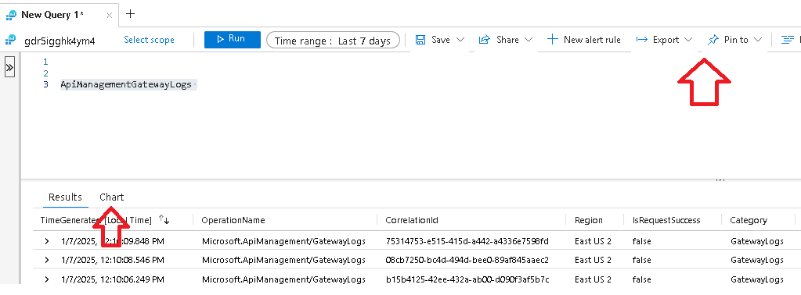

# Laboratorio Azure Day - Azure Monitor

## Diagnostic logs

1. No portal do Azure abrir o Application Gateway ou Azure APIM
2. No Menu **Monitoring** clicar em **Diagnostic settings**
3. Na linha do log de diagnostico clicar em **Edit settings** e observar as opções (Não realizar alteracoes).

## Log Analytic worspace

1. No portal do Azure buscar por **"Log analytic worspaces"** na barra de busca e abrir o LAW criado no laboratorio.

2. No menu settings clicar em **"Usage and estimated costs"**

3. Explorar as opções de acompanhamento de consumo do workspace.

    + Menu superior **Daily Cap**, **Data Retention** e **Insights**
    + Grafico de uso diario ao lado direito

4. No menu settings clicar em **Tables** e explorar as configurações das tabelas, perido de retenção (não fazer alterações).

1. No menu clicar em **Logs** e explorar o Query Hub.

    

2. Explorar as tabs **Tables** **Queries** **Functions**
    
    

3. Executar uma query no painel de consulta e observar os botoes de **Chart**, **Export** **Pin to**

    

4. Vamos consultar os ultimos erros de resposta de API através do APIM. No painel de query executar:

    ```
    ApiManagementGatewayLogs 
    | where BackendResponseCode != 200
    | project Url, ResponseCode, LastErrorSource, LastErrorReason, LastErrorMessage
    ```

> Exemplo para monitoração de APIs do OpenAI: [Implement logging and monitoring for Azure OpenAI models](https://learn.microsoft.com/en-us/azure/architecture/ai-ml/openai/architecture/log-monitor-azure-openai)

## Data Explorer com Azure Monitor

Não temos um laboratorio neste tema, apenas como referencia, muitas vezes queremos utilizar uma solução de monitoração, armazendo os logs em um storage account e so quero consultar em um momento de throubleshooting.

Existem diferentes maneiras de resolver este challenge e o uso do Azure Data Explorer é uma destas opções.

[Query data in Azure Monitor using Azure Data Explorer](https://learn.microsoft.com/en-us/azure/data-explorer/query-monitor-data)

[Get data from Azure storage](https://learn.microsoft.com/en-us/azure/data-explorer/get-data-storage)

[Ingest JSON formatted sample data](https://learn.microsoft.com/en-us/azure/data-explorer/ingest-json-formats?tabs=kusto-query-language)

## Referencias do módulo

1. [Azure Monitor](https://learn.microsoft.com/en-us/azure/azure-monitor/overview)

2. [APIM Observability](https://learn.microsoft.com/en-us/azure/api-management/observability)

3. [Diagnostics logs settings reference: API Management](https://learn.microsoft.com/en-us/azure/api-management/diagnostic-logs-reference)

4. [Azure Network Watcher](https://learn.microsoft.com/en-us/azure/network-watcher/network-watcher-overview)

5. [AKS Container insights](https://learn.microsoft.com/en-us/azure/azure-monitor/containers/container-insights-analyze)

6. [Managed Prometheus](https://learn.microsoft.com/en-us/azure/azure-monitor/essentials/prometheus-metrics-overview)

7. [Managed Grafana](https://learn.microsoft.com/en-us/azure/azure-monitor/visualize/grafana-plugin)

8. [Log analytics with PowerBI](https://learn.microsoft.com/en-us/azure/azure-monitor/logs/log-powerbi)

9. [Azure Monitor Workbooks](https://learn.microsoft.com/en-us/azure/azure-monitor/visualize/workbooks-overview)