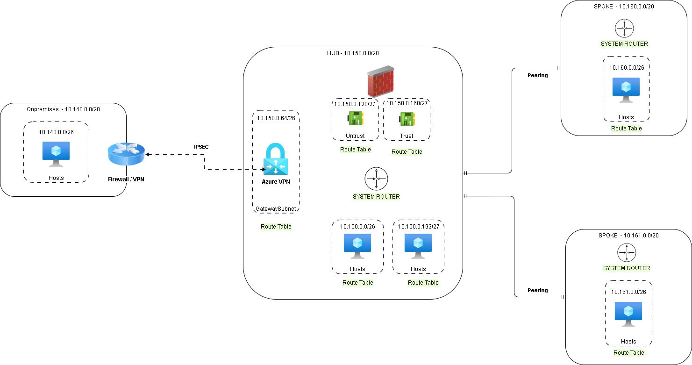
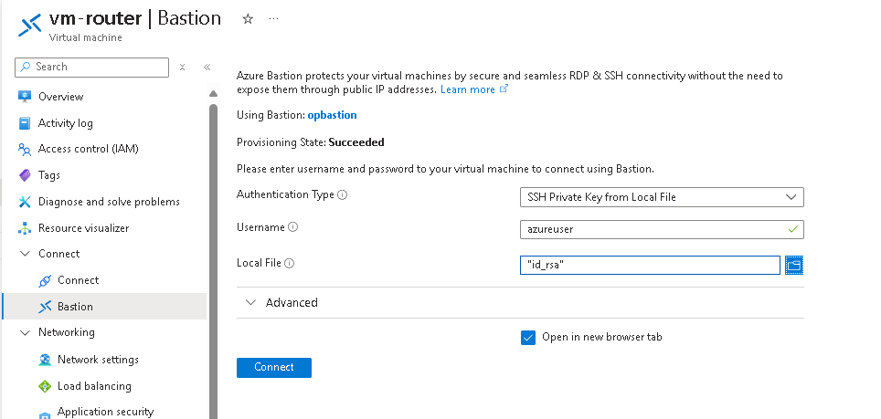
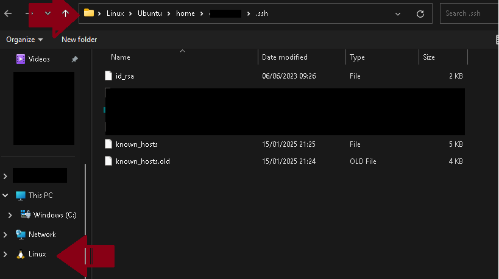
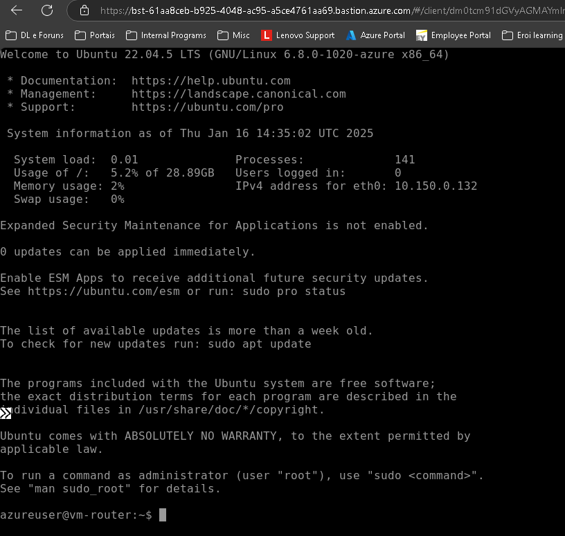

# NETWORK LAB - Routing and VPN

## Scenario

You have a Hub&Spoke network 150, 160 and 161 that need connect with remote network 140 through the VPN.

Also, a routing firewall (linux VM aka route) need routing the traffic among networks 140 > 160 and 161 as well as between spokes 160 and 161.

## Diagram

## LAB Setup. 

The script [LAB1 Script](lab1-script.sh) have all the commands to build the LAB that allow you emulate this scenario. But, some steps to complete all the goals are not inside the script and is part of the challenge. 

## Goals

These are the targets to accomplish on the LAB.

1. Access through the route trust interface from VM 10.160.0.4 to:
    + VM 10.140.0.4 (ping / tracert / ssh)
    + VM 10.161.0.4 (ping / tracert / ssh)

2. The VPN traffic should IN on untrust interface and out on trust to reach the network 160 and 161.

3. The internal traffic between 160 and 161 should.

4. Understand the behavior of the Effetive Route on the VMs during each configuration and how the peering, user route, VPN, etc influency the routing.

5. Evaluate the different configurations on the VNET Peering.

## Lab Access 

1. **Use the Azure Bastion to do the SSH connection. The Virtual Machines will be created to generate a SSH Key localy (.ssh folder on the profile.)**

    > **You can change to any other way to authenticate. it's only the LAB defaults.**

    

2. **To Browse my Keys on WSL environment I used the Windows Explorer integration with WSL.**

    

3. **And you can access the SSH of the linux VM.**

    